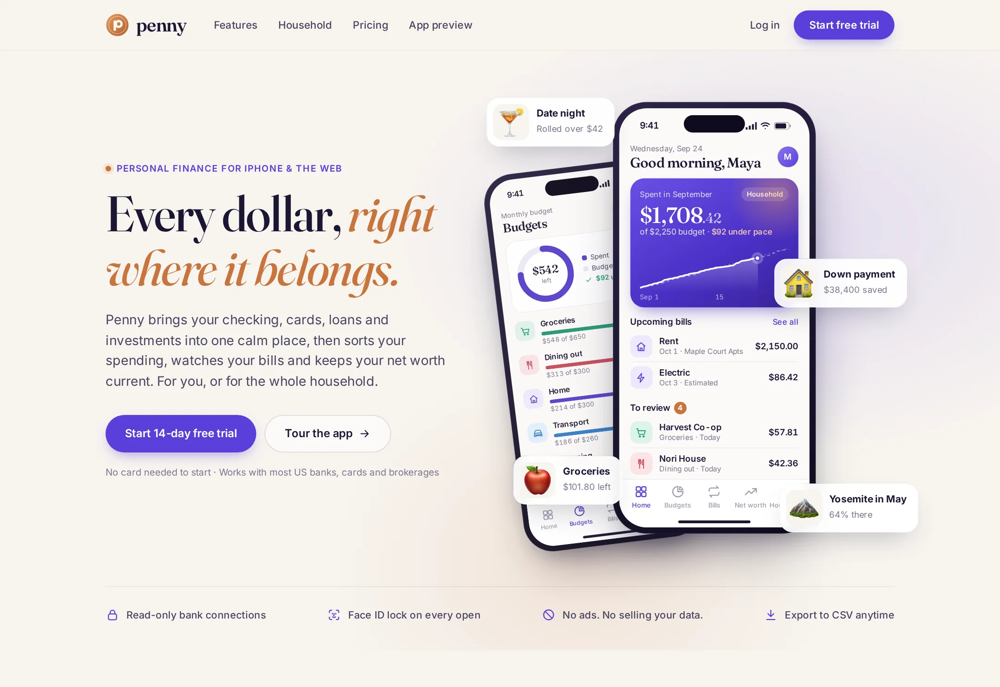

# Penny

Budgets, bills, net worth and a shared household view, on iPhone and the web.

**Live demo:** https://www.freelancerportfoliohub.com/jameslee/projects/pennyapp/index.html



## Overview

Penny pulls checking, cards, loans and investments into one calm place, then sorts spending, tracks recurring bills and
keeps net worth current, for one person or a two-person household. This repository contains:

- **`/` (Next.js)** — the product site: home, features, household, pricing and an interactive app preview, plus the
  web dashboard mock and a small API.
- **`mobile/` (Expo)** — the iPhone app built with Expo Router: Home, Budgets, Bills, Net worth and Household tabs.

Both apps render from the same sample household (Maya & Jordan, September), and every derived number (total spent,
pace, net worth, what Jordan owes) is computed from it in one place, so the phone, the site and the dashboard always
agree.

## Features

- **Daily home view** — spend against budget with a cumulative chart vs. last month and a budget-pace line
- **Budgets with rollovers** — progress ring, per-category bars, over-budget states and carried-over money
- **Recurring bills** — 30-day total, week calendar, and price-change flags for subscriptions that crept up
- **Net worth** — grouped balance sheet, 12-month history and allocation
- **Household** — shared vs. private accounts, 50/50 split, settle-up balance and shared goals
- **Web dashboard** — KPIs, spending chart, budgets, transaction table and upcoming bills
- **Interactive preview** — tab list, in-phone tab bar, dots, arrow keys and swipe drive one screen carousel
- **API** — `GET /api/summary`, `GET|PATCH /api/transactions` (filter + recategorize), `POST /api/household/settle`
- **Data model** — Prisma schema for households, members, accounts, snapshots, budgets, transactions, rules, bills, goals

## Tech stack

| Layer   | Tools                                                                            |
| ------- | -------------------------------------------------------------------------------- |
| Web     | Next.js 15 (App Router), React 19, TypeScript (strict), CSS, `next/font` (Fraunces, Inter) |
| API     | Route handlers, zod, Prisma (PostgreSQL) with an in-memory sample ledger fallback |
| Mobile  | Expo SDK 54, Expo Router 6, React Native 0.81, react-native-svg, expo-image      |
| Tooling | ESLint 9, Prettier, pnpm                                                         |

## Getting started

```bash
pnpm install
pnpm dev            # http://localhost:3000
```

The site runs on the bundled sample household with no configuration. To back the API with Postgres:

```bash
cp .env.example .env.local   # set DATABASE_URL
pnpm db:push
```

Mobile app:

```bash
cd mobile
pnpm install
pnpm start          # i for iOS simulator, a for Android
```

## Project structure

```
.
├── app/                    # /, /features, /household, /pricing, /app, api/
├── components/
│   ├── brand/ layout/ ui/  # logo, header/footer/CTA, icons, chips, buttons, FAQ
│   ├── charts/             # SpendChart, NetWorthChart, Donut, Sparkline
│   ├── phone/              # phone frame, status bar, tab bar, rows, screens/
│   ├── cards/              # review, rollover, cash flow, recurring, accounts, allocation, goals
│   ├── dashboard/          # web dashboard + transactions table
│   ├── home/ features/ household/ pricing/ preview/
├── lib/
│   ├── data/               # sample household + page content
│   ├── finance.ts          # derived totals, pace, net worth, split
│   ├── money.ts            # currency formatting
│   ├── charts.ts           # SVG geometry
│   ├── services/ledger.ts  # LedgerRepository (Prisma or sample)
│   └── db.ts
├── prisma/schema.prisma
├── types/
├── public/images/
└── mobile/
    ├── app/(tabs)/         # index (Home), budgets, bills, net-worth, household
    ├── components/
    ├── constants/theme.ts
    └── lib/                # data, finance, money, charts, types
```

## Scripts

| Command            | Description                     |
| ------------------ | ------------------------------- |
| `pnpm dev`         | Start the site with Turbopack   |
| `pnpm build`       | Production build                |
| `pnpm start`       | Serve the production build      |
| `pnpm lint`        | ESLint                          |
| `pnpm typecheck`   | `tsc --noEmit`                  |
| `pnpm format`      | Prettier                        |
| `pnpm db:generate` | Generate the Prisma client      |
| `pnpm db:push`     | Push the schema to the database |

In `mobile/`: `pnpm start`, `pnpm ios`, `pnpm android`, `pnpm lint`, `pnpm typecheck`.
