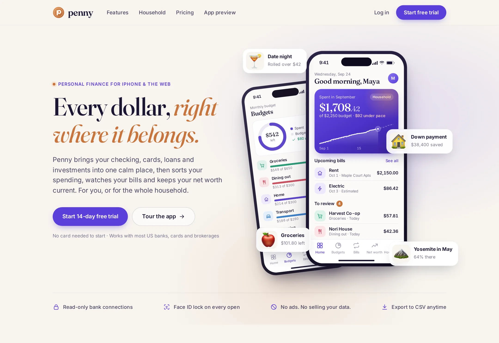

# Penny

Budgets, bills, net worth and a shared household view, on iPhone and the web.

**Live demo:** https://www.freelancerportfoliohub.com/jameslee/projects/pennyapp/index.html



## Overview

Penny pulls checking, cards, loans and investments into one calm place, then sorts spending, tracks recurring bills and
keeps net worth current, for one person or a two-person household. Everything is one Swift package:

- **`PennyCore`** — the household as plain Swift values: integer-cent money, budgets and rollovers, bills, net worth,
  the household split and settle-up rules, chart geometry and the transaction ledger. No platform dependencies.
- **`PennyUI` + `iOS/`** — the SwiftUI iPhone app: Home, Budgets, Bills, Net worth and Household tabs.
- **`PennyWeb` + `penny-server`** — the product site (home, features, household, pricing and an interactive app
  preview), the web dashboard mock and a small JSON API, served by Hummingbird.

The phone, the site and the dashboard all render from the same sample household (Maya & Jordan, September), and every
derived number (total spent, pace, net worth, what Jordan owes) is computed from it in one place in `PennyCore`, so
they always agree.

## Features

- **Daily home view** — spend against budget with a cumulative chart vs. last month and a budget-pace line
- **Budgets with rollovers** — progress ring, per-category bars, over-budget states and carried-over money
- **Recurring bills** — 30-day total, week calendar, and price-change flags for subscriptions that crept up
- **Net worth** — grouped balance sheet, 12-month history and allocation
- **Household** — shared vs. private accounts, 50/50 split, settle-up balance and shared goals
- **Review queue** — long-press a transaction on iPhone to confirm or change its category; budgets update with it
- **App lock** — Face ID or passcode every time the app opens, balances hidden in the app switcher
- **Web dashboard** — KPIs, spending chart, budgets, transaction table and upcoming bills
- **Interactive preview** — tab list, in-phone tab bar, dots, arrow keys and swipe drive one screen carousel
- **API** — `GET /api/summary`, `GET|PATCH /api/transactions` (filter + recategorize), `POST /api/household/settle`
- **Data model** — Postgres schema for households, members, accounts, snapshots, budgets, transactions, rules, bills, goals

## Tech stack

| Layer   | Tools                                                                                      |
| ------- | ------------------------------------------------------------------------------------------ |
| Core    | Swift 6, SwiftPM, swift-testing                                                            |
| iPhone  | SwiftUI (iOS 17+), Observation, LocalAuthentication, XcodeGen project spec                 |
| Web     | Server-rendered HTML from a small Swift result builder, CSS, a dependency-free `site.js`   |
| API     | Hummingbird 2, PostgresNIO (PostgreSQL) with an in-memory sample ledger fallback           |
| Deploy  | Docker (multi-stage, `swift:6.4-noble`), Railway                                           |

## Getting started

Requires Swift 6.0 or later (Xcode 16 on macOS, or the swift.org toolchain on Linux).

```bash
swift run penny-server      # http://localhost:8080
swift test
```

The site and API run on the bundled sample household with no configuration. To back the API with Postgres:

```bash
cp .env.example .env        # set DATABASE_URL
export $(grep -v '^#' .env | xargs)
swift run penny-server seed # create the tables and load the sample household
swift run penny-server
```

`penny-server migrate` creates or updates the tables without loading any data. Settings come from the environment:
`PORT` (default 8080), `HOST` (default `0.0.0.0`), `DATABASE_URL`, `STATIC_DIR` (default `static`) and `LOG_LEVEL`.

iPhone app:

```bash
brew install xcodegen
cd iOS
xcodegen generate
open Penny.xcodeproj        # run the Penny scheme on an iOS 17+ simulator
```

The app shows the sample household on the device. Set `PennyAPIBaseURL` in `iOS/project.yml` to a running server to
send category fixes and settle-ups to the API.

Docker:

```bash
docker build -t penny .
docker run -p 8080:8080 penny
```

On Railway, connect the repository and it builds from the `Dockerfile`; `railway.json` sets the health check to
`/healthz`. Add a Postgres service and a `DATABASE_URL` variable to use the database ledger.

## Testing

`swift test` runs the suites for every Linux-buildable target:

- **PennyCoreTests** — money and formatting, every derived figure on the screens, split and settle-up rules, chart
  geometry, the SVG path parser (including arcs) for every icon, the ledger and the API wire format
- **PennyWebTests** — escaping, each page renders balanced markup with unique gradient ids, and the key numbers appear
- **PennyServerTests** — every API route and validation error, HTML 404s, static files and configuration parsing
- **PennyClientTests** — request building and error handling in the API client

`PennyUI` only builds where SwiftUI is available, so open the package or the generated project in Xcode to build it
and use the previews in `Previews.swift`. On Linux the server tests link zlib, so install `zlib1g-dev` first.

## Project structure

```
.
├── Package.swift
├── Sources/
│   ├── PennyCore/
│   │   ├── Model/            # categories, transactions, bills, accounts, goals, colours, calendar
│   │   ├── Money/            # Money (integer cents) and en-US formatting
│   │   ├── Household/        # Household, split policies, settle-up
│   │   ├── Finance/          # derived totals, pace, net worth, account groups
│   │   ├── Charts/           # chart geometry, SVG path parser, arc conversion
│   │   ├── Icons/            # the 24×24 line icon set
│   │   ├── Ledger/           # LedgerRepository + in-memory ledger, query validation
│   │   ├── API/              # JSON wire models
│   │   └── Sample/           # the Maya & Jordan sample household
│   ├── PennyWeb/
│   │   ├── HTML/             # escaping result builder, elements, render scope
│   │   ├── Components/       # phone screens, cards, charts, dashboard, sections
│   │   ├── Content/          # page copy: features, pricing, FAQ, testimonials
│   │   └── Pages/            # layout and the five pages
│   ├── PennyServerKit/       # Hummingbird routes, middleware, Postgres ledger, schema, seed
│   ├── PennyServer/          # penny-server entry point
│   ├── PennyClient/          # URLSession API client
│   └── PennyUI/              # SwiftUI design system, charts, store and the five tabs
├── Tests/                    # PennyCore, PennyWeb, PennyServer and PennyClient suites
├── iOS/
│   ├── project.yml           # XcodeGen spec for the app target
│   └── Penny/                # app entry point and asset catalog
├── static/                   # site.css, site.js, icon and shared artwork
├── Dockerfile
└── railway.json
```

## Commands

| Command                       | Description                                   |
| ----------------------------- | --------------------------------------------- |
| `swift run penny-server`      | Serve the site and API on `$PORT`             |
| `swift run penny-server migrate` | Create or update the Postgres tables       |
| `swift run penny-server seed` | Migrate, then load the sample household       |
| `swift build -c release`      | Release build                                 |
| `swift test`                  | Run the test suites                           |
| `xcodegen generate` (in `iOS/`) | Generate the Xcode project                  |
